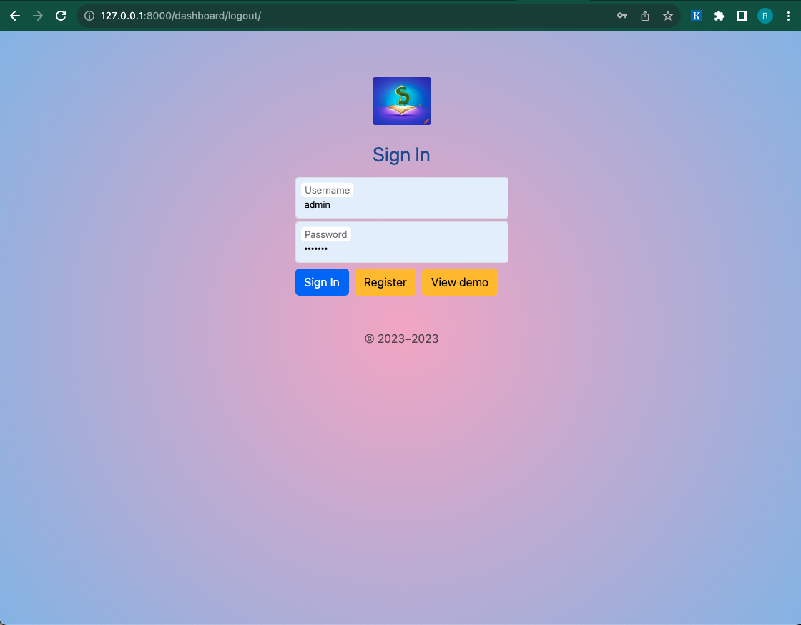
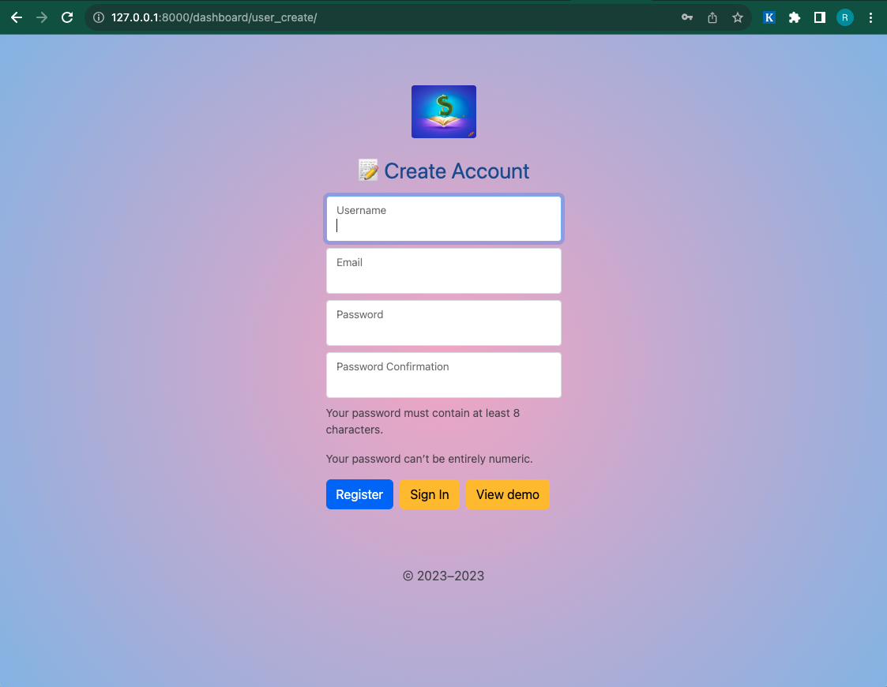
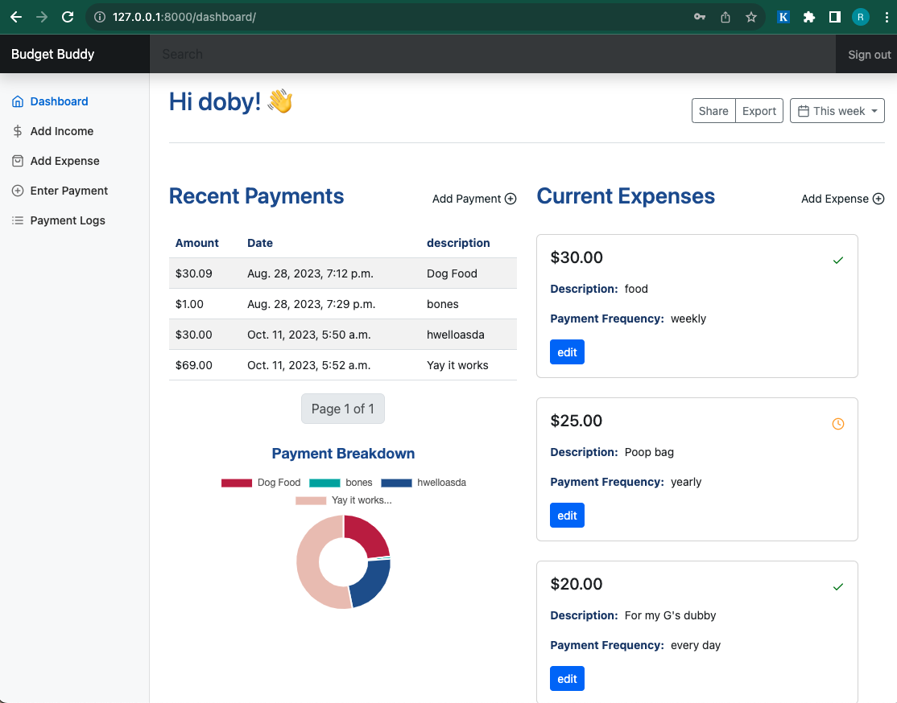

  <h1>Buget Buddy </h1>

The Money Management Dashboard is a web application designed to help users manage their finances, track expenses, and gain insights into their spending habits.

## Features 
- [x] User Authentication: Users can create accounts, log in, and securely access their financial data.
- [ ] Expense Tracking: Users can add, edit, and categorize their expenses, providing detailed records of their financial transactions.
- [x] Data Visualization: The dashboard presents expenses and financial data in visually informative charts and graphs. (might change)
- [ ] User Profile: Users can update their profile information and customize their dashboard settings.

## Current UI

 
 
 

